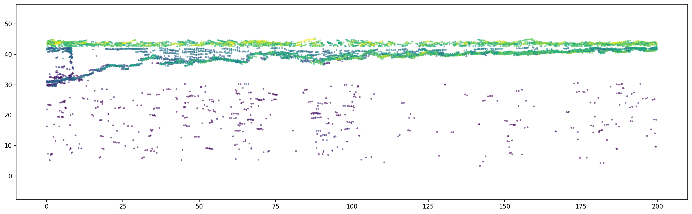
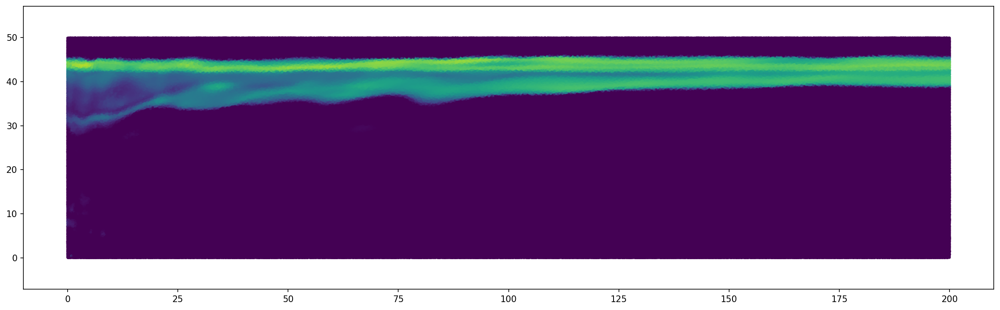

# lasnerf: Converting LAS Files to Neural Radiance Fields (NERF)

## Introduction

Welcome to `lasnerf`. This repository focuses on converting LAS files, a standard lidar data format, into Neural Radiance Fields (NERF). Unlike typical NERF applications that use RGB data, this project leverages the intensity and volumetric density information from lidar to generate novel views and create differential datasets.

## Why Use Lidar and NERF Together

Lidar provides accurate 3D coordinates and intensity information. When combined with NERF, this data can be used to generate novel views of a captured scene and to create differential datasets. The precision of lidar point clouds serves as a strong foundation for NERF's capabilities.

## How it Works

### Data Preparation: Normalizing LAS Files

LAS files contain point clouds and associated intensity values from lidar sensors. These intensity values are normalized to a range between 0 and 1 to make them compatible with the NERF model.

### Feature Engineering: Fourier Cosine Transformation

A Fourier cosine function is applied to the input values to improve the coherence of finer details in the NERF model. This Fourier cosine function helps capture high-frequency variations in the structure.

### Neural Network Training

The neural network architecture consists of fully connected layers with ReLU activations. The model is trained to predict volumetric densities at given 3D coordinates based on the normalized lidar data.

### Post-Training Applications

After training, the NERF model can generate novel views of the lidar-captured scene. This allows for dynamic exploration of the data. Additionally, differential datasets can be generated to observe changes over time or under different conditions.

## Use Case: Kelp Mapping with Topobathymetric Lidar

In ecological studies, such as kelp forest mapping, traditional lidar can provide the topographic layout. NERF adds an additional layer by enabling the generation of novel views and differential datasets, useful for monitoring and research.

## Getting Started

1. **Clone the Repository**: `git clone https://github.com/kkmcgg/lasnerf.git`
2. **Install Dependencies**: Run `pip install -r requirements.txt`
3. **Run the Script**: Execute `python las_to_nerf.py --input yourfile.las --output youroutput.nrf` (work in progress!)

## Conclusion

`lasnerf` extends the capabilities of lidar data by integrating it with Neural Radiance Fields. The project allows for more than just static point clouds; it enables dynamic exploration and differential analysis. 

## References
- [LiDAR-NeRF: Novel LiDAR View Synthesis via Neural Radiance Fields](https://arxiv.org/abs/2304.10406)
- [Noise Equivalence Reflectance Factor](https://ntrs.nasa.gov/api/citations/19800004148/downloads/19800004148.pdf) (the OTHER lidar nerf)
